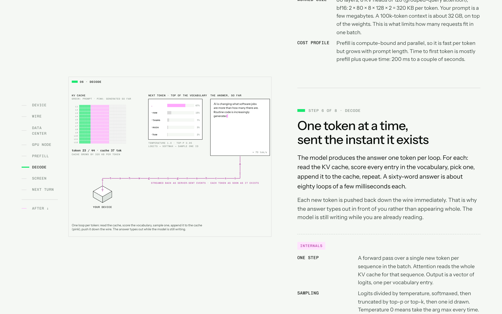
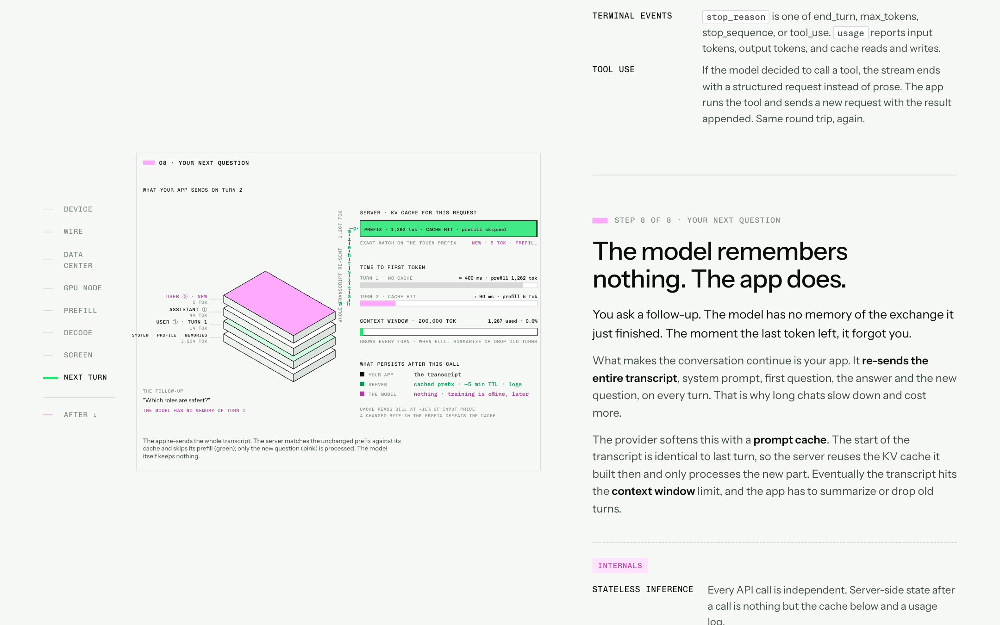
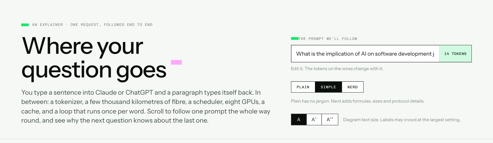

# Prompt Round Trip

An interactive, scroll-driven explainer of what happens when you send a question to Claude or ChatGPT: from your keyboard, over the wire, into a data center, across eight GPUs, through prefill and decode, back to your screen, and then how the next question knows about the last one.

Eight steps, each with an animated isometric scene on a sticky stage and a card that explains what the thing is and how it works. A **Plain / Simple / Nerd** toggle sets the depth: Plain is jargon-free with an everyday analogy per step and a quieter stage; Nerd adds the internals (formulas, sizes, protocol details). A diagram text-size control (A / A+ / A++) enlarges the stage labels. The prompt is editable and its tokens ride the wires.

After the eight steps: where your profile and preferences enter the request (step 1) and why they shape the answer (step 5); the three caches and which step each changes (step 8); a comparison of who runs which step for a closed API, hosted open weights, and a laptop; a "language of the machine is numbers" strip showing text, code and an image each becoming numbers before the same arithmetic runs, and how the output loop differs by medium; and a privacy section mapping where along the journey a personal question can actually be seen (not the shared GPU batch, but logs, training, review, memory), with a checklist for sensitive documents and the offline path logged conversations take if training is on; a live bill for the current prompt (price, raw compute share, electricity, water, and a latency waterfall); a six-rung scale ladder from one request to the grid, linking to Data Center Builder; and a who-makes-what table per layer. A jump-link row after step 8 navigates these sections.

## Screenshots

**Step 6, decode**, Nerd depth. The KV cache grows one pink column per generated token, the sampling panel shows the top of the vocabulary, and each token rides the wire back to the device as it is produced:



**Step 8, the next turn.** The app re-sends the whole transcript; the server matches the unchanged prefix against its cache (green) and prefills only the new question (pink):



**The opening**, with the editable prompt and the depth and text-size controls:



## Running it

It is a single self-contained `index.html` with no build step. Open the file, or serve it:

```bash
python3 -m http.server 8000
# open http://localhost:8000
```

Fonts (Chivo Mono, Instrument Sans) load from Google Fonts with system fallbacks. Nothing else is fetched and no API is called; the answer text is a fixed example.

## Publishing

Hosted on GitHub Pages from the `main` branch root. Push to `main` and the site updates within a minute.

## Design

The visual language borrows from Baseten's homepage hero (off-white ground, thin grey rules, isometric cubes, characters streaming along wires, one green and one pink accent, mono labels). The structure borrows from Prompt to Chip (sticky stage plus scroll cards, depth toggle). The approved design spec is in `docs/superpowers/specs/`.

Colour key on the stage: **green** is your request and anything computed from it this turn; **pink** is what is new (generated tokens, the uncached part of a follow-up); grey is other people's traffic and the machinery.

## Caveats

Numbers are typical of frontier-model serving in 2026 and are labelled as ranges. The tokenizer is an approximation. Some providers shard across nodes, use mixture-of-experts, or split prefill and decode across machines; the shape of the journey is the same.
